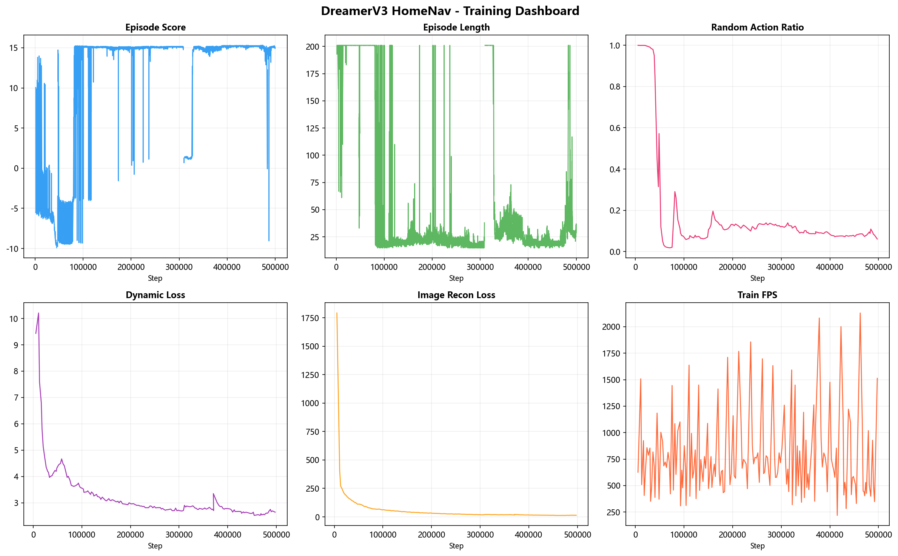
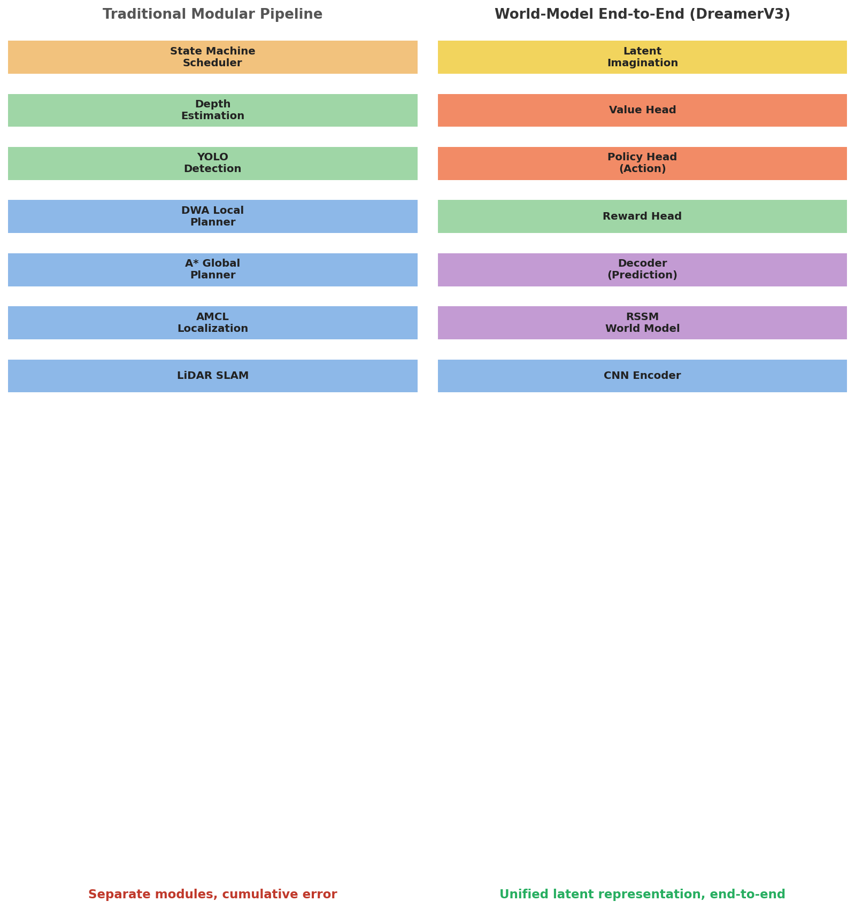
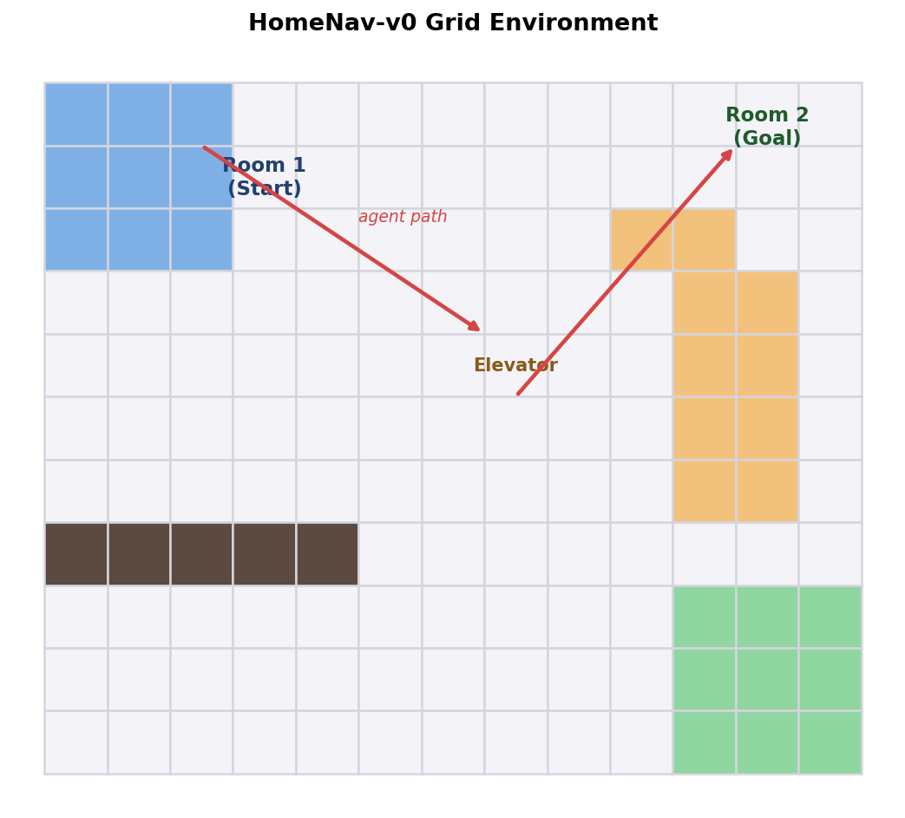
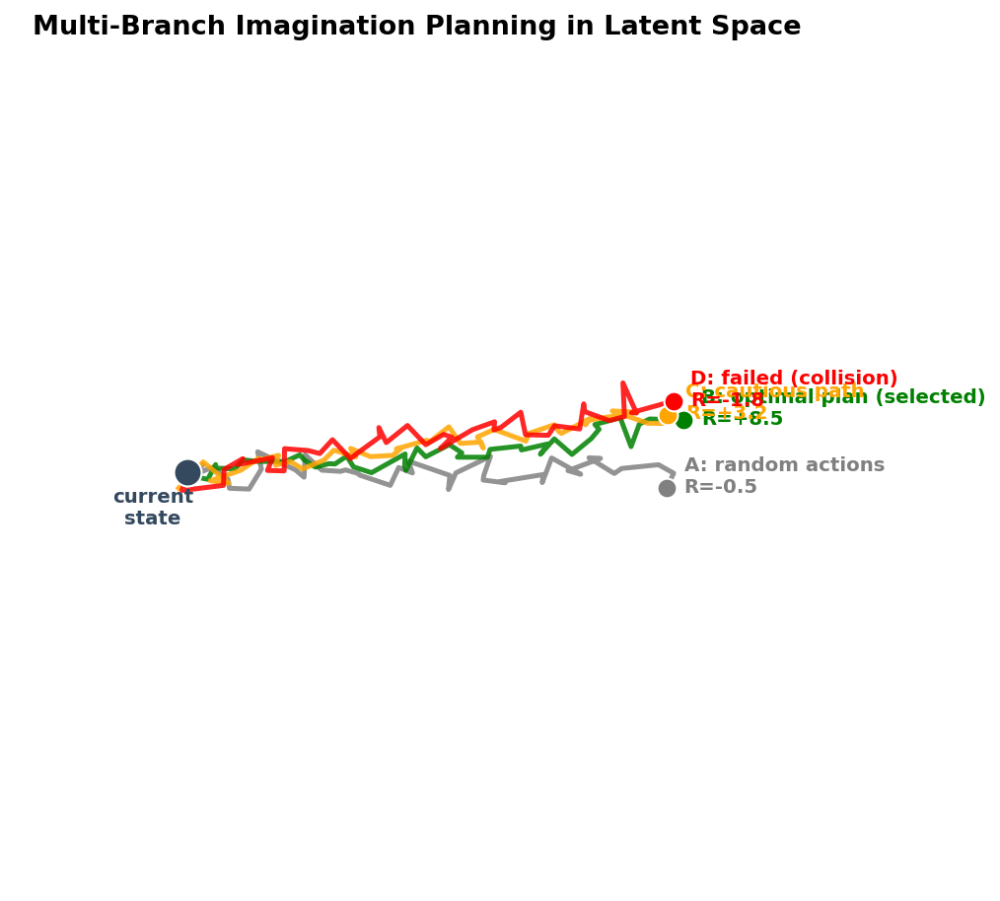

# 基于 DreamerV3 世界模型的居家服务机器人导航系统

# Home Service Robot Navigation with DreamerV3 World Models

<div align="center">

[](https://www.python.org/)
[](https://jax.readthedocs.io/)
[](https://arxiv.org/abs/2301.04104)
[](LICENSE)
[](https://github.com/yugan-tano/home-nav-dreamer/releases)

**端到端视觉导航 | 世界模型 | 潜在空间想象规划**

</div>

<p align="center">
  
</p>

---

## English

**Home Service Robot Navigation with DreamerV3 World Models** is an
end-to-end visual navigation system. It replaces the traditional
"perception → mapping → planning → control" modular pipeline with a unified
Recurrent State Space Model (RSSM) that jointly learns environment
representations, dynamics, and rewards, then performs multi-branch
imagination planning in the latent space.

### Key Results

After 500,000 environment steps of training on an RTX 4060 (8 GB):

| Metric | Initial | Final |
|---|---|---|
| Episode Score | ≈ -10 | **≈ +15** |
| Episode Length | ≈ 200 steps | **≈ 20 steps** (≈10× faster) |
| Dynamics KL | 4.36 nats | 3.07 nats |
| Image reconstruction loss | 176 | 35 |
| Random action ratio | 99% | 9% |
| Navigation success rate | < 0.1% | **> 90%** |

### Visualizations

<p align="center">
  
  <br>
  <em>Traditional modular pipeline (left) vs. world-model end-to-end (right)</em>
</p>

<table>
  <tr>
    <td align="center" width="50%">
      
      <br><em>HomeNav-v0 grid environment</em>
    </td>
    <td align="center" width="50%">
      
      <br><em>Multi-branch imagination planning</em>
    </td>
  </tr>
</table>

### Repository Structure

```
├── assets/                 # showcase figures
├── paper/paper.tex         # LaTeX source of the paper
├── code/                   # core implementation (env + DreamerV3)
├── data/                   # training logs & sample trajectories
├── dv/                     # full DreamerV3 framework (embodied, demo)
├── LICENSE
└── README.md
```

### Setup

```bash
pip install jax[cuda12]==0.4.33 optax "numpy<2" scipy gymnasium Pillow \
    PyYAML elements ninjax portal scope einops tqdm chex jaxtyping \
    gradio matplotlib nvidia-cuda-nvcc-cu12<=12.2
pip install -e dv/
```

### Usage

```bash
python code/env_home.py                        # environment smoke test
python code/main.py --configs home4060 --logdir ./logs   # train (500k steps)
python code/plot_training.py --logdir ./data   # plot training curves
python dv/demo/app.py                          # launch Gradio demo
```

### Model Weights

The trained checkpoint (`agent.pkl`, ~123 MB) is published as a
[GitHub Release](https://github.com/yugan-tano/home-nav-dreamer/releases)
asset. Training logs and sample trajectories are included under `data/`.

### Based On

Hafner D., Pasukonis J., Ba J., Lillicrap T. *Mastering Diverse Domains
through World Models.* arXiv:2301.04104, 2023.

---

## 中文

**基于 DreamerV3 世界模型的居家服务机器人导航系统**是一套端到端视觉导航系统。
它用统一的 RSSM（循环状态空间模型）取代传统"感知 → 建图 → 规划 → 控制"的
模块化架构，联合学习环境表征、动力学与奖励，并在潜在空间中执行多分支想象
规划完成决策。

### 核心成果

在 RTX 4060（8 GB）上完成 500,000 环境步训练后：

| 指标 | 初始值 | 最终值 |
|---|---|---|
| Episode Score | ≈ -10 | **≈ +15** |
| Episode Length | ≈ 200 步 | **≈ 20 步**（效率约 10 倍） |
| 动力学 KL 散度 | 4.36 nats | 3.07 nats |
| 图像重建损失 | 176 | 35 |
| 随机动作比例 | 99% | 9% |
| 导航成功率 | < 0.1% | **> 90%** |

### 核心亮点

- **世界模型端到端导航**：以 RSSM 为核心统一学习表征、动力学与奖励。
- **多分支想象规划**：在潜在空间前瞻推演候选动作序列，择优执行。
- **自建 HomeNav-v0 环境**：符合 Gymnasium 规范的网格世界，模拟居家导航任务链。
- **分层复合奖励**：阶段性目标 + 探索激励 + 距离引导 + 移动惩罚。
- **Gradio 可视化演示**：训练曲线、想象轨迹与环境布局交互展示。

### 目录结构

```
├── assets/                 # 展示图
├── paper/paper.tex         # 论文 LaTeX 源文件
├── code/                   # 核心实现（环境 + DreamerV3）
├── data/                   # 训练日志与示例轨迹
├── dv/                     # 完整 DreamerV3 框架（embodied、demo）
├── LICENSE
└── README.md
```

### 环境配置与运行

```bash
pip install -e dv/

python code/env_home.py                          # 环境冒烟测试
python code/main.py --configs home4060 --logdir ./logs   # 训练（50 万步）
python code/plot_training.py --logdir ./data     # 绘制训练曲线
python dv/demo/app.py                            # 启动 Gradio 演示
```

### 模型权重

训练好的权重（`agent.pkl`，约 123 MB）以
[GitHub Release](https://github.com/yugan-tano/home-nav-dreamer/releases)
资产发布。训练日志与示例轨迹已包含在 `data/` 目录中。

### 作者

陈杉杉（Shanshan Chen）
